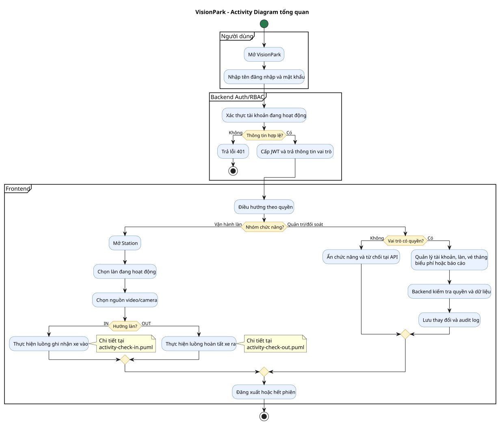
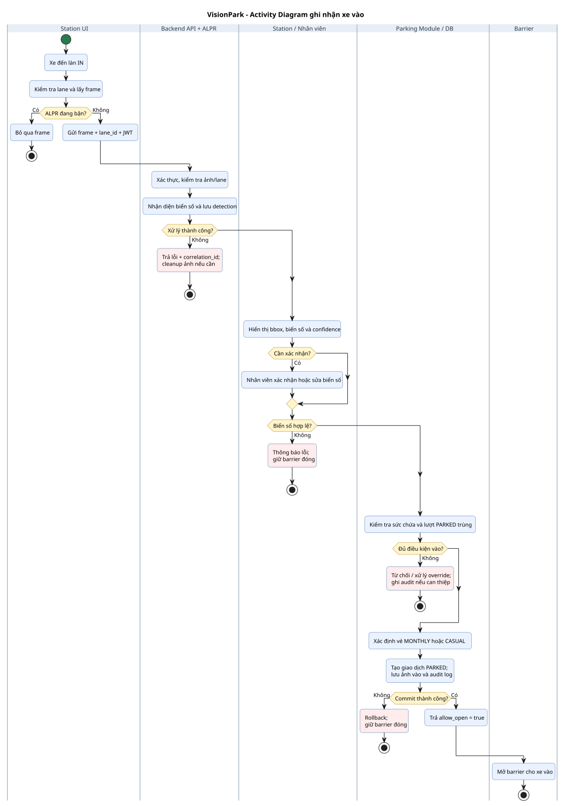
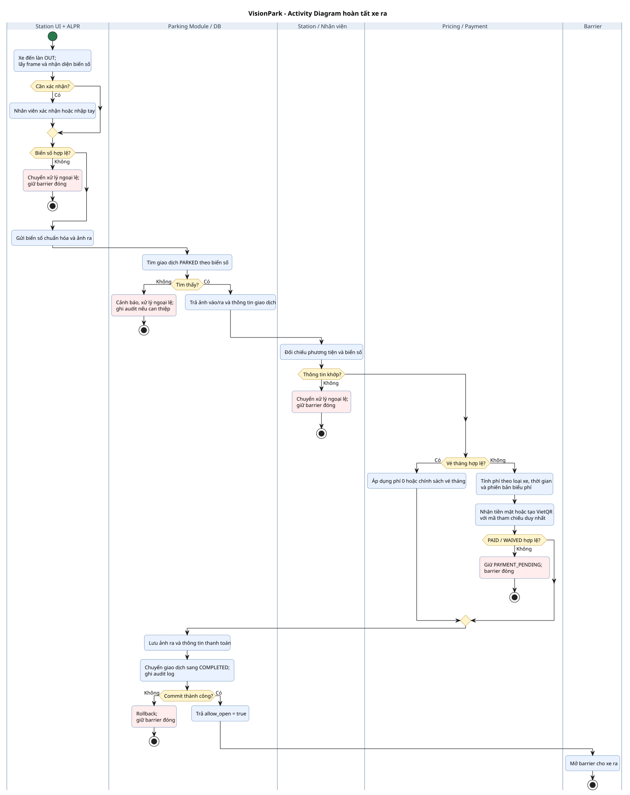

# Activity Diagram - VisionPark

Tài liệu này mô tả các luồng hoạt động chính của VisionPark theo BA/SRS tại
`docs/Document.md` và kiến trúc tại `docs/architecture.md`.

> **Phạm vi:** đây là sơ đồ **To-Be của MVP**. Tại thời điểm lập sơ đồ, repository
> mới hiện thực phần nền backend, xác thực/RBAC và biên ALPR; các module giao dịch
> gửi xe, tính phí, thanh toán và điều khiển barrier vẫn là thiết kế mục tiêu.

## Danh sách sơ đồ

| Sơ đồ | Mục đích | File nguồn | Bản xem |
| --- | --- | --- | --- |
| Tổng quan hệ thống | Đăng nhập, phân quyền và chọn nhóm chức năng | `activity-overview.puml` | `VisionPark_Activity_Overview.svg` |
| Ghi nhận xe vào | Nhận diện, xác nhận biển số, chống trùng, phân loại vé và mở barrier | `activity-check-in.puml` | `VisionPark_Activity_CheckIn.svg` / `.png` |
| Hoàn tất xe ra | Đối chiếu, tính phí, thanh toán và mở barrier | `activity-check-out.puml` | `VisionPark_Activity_CheckOut.svg` / `.png` |

## Quy ước

- Mỗi swimlane thể hiện một bên chịu trách nhiệm trong quy trình.
- Hai luồng xe vào/ra dùng bố cục gần tỷ lệ A4 dọc để thuận tiện chèn vào báo cáo.
- Chỉ mở barrier sau khi dữ liệu bắt buộc đã được commit thành công.
- Mọi sửa dữ liệu, xử lý ngoại lệ hoặc override phải được ghi audit log.
- Nhánh lỗi kết thúc với barrier đóng, trừ khi người có quyền thực hiện override.

## Cách xem

Mở các file `.puml` bằng extension PlantUML trong VS Code/IntelliJ, hoặc render bằng
PlantUML CLI:

```powershell
plantuml docs/activity-overview.puml `
  docs/activity-check-in.puml `
  docs/activity-check-out.puml
```

## Bản xem nhanh

### Tổng quan hệ thống



### Ghi nhận xe vào



### Hoàn tất xe ra


