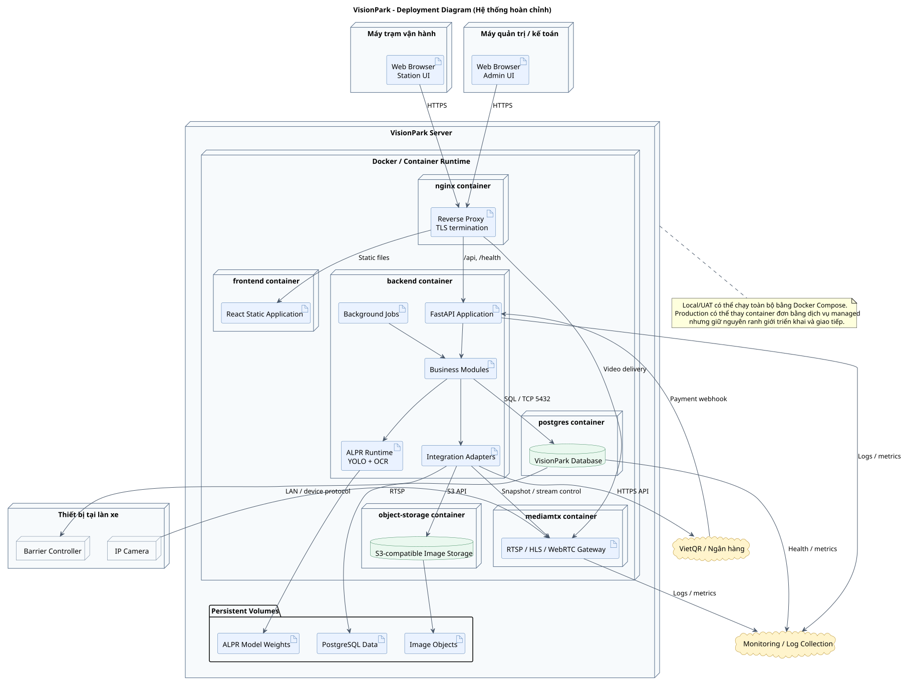
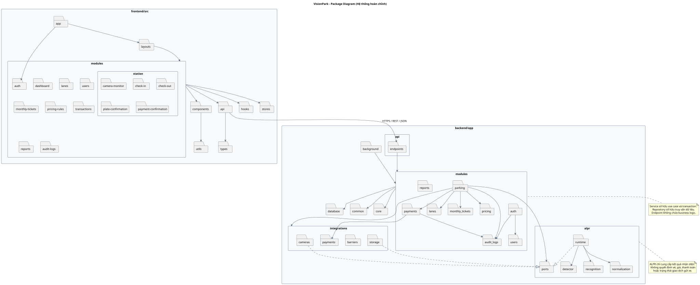

# VisionPark – Sơ đồ kiến trúc hệ thống hoàn chỉnh

Bộ sơ đồ này mô tả kiến trúc mục tiêu đầy đủ của VisionPark, không giới hạn ở lát cắt Phase 1 dùng Mock ALPR.

## Component Diagram

Nguồn PlantUML: [`component-diagram.puml`](./component-diagram.puml).

## Deployment Diagram

Nguồn PlantUML: [`deployment-diagram.puml`](./deployment-diagram.puml).

## Package Diagram

Nguồn PlantUML: [`package-diagram.puml`](./package-diagram.puml).

## Phạm vi

- Một React application phục vụ Station UI và Admin UI.
- Một FastAPI modular monolith chứa nghiệp vụ và module ALPR.
- Camera/MediaMTX, barrier, VietQR/ngân hàng và object storage được tích hợp qua adapter.
- PostgreSQL là nguồn dữ liệu chuẩn; ảnh không được lưu dạng blob trong database.
- Deployment mục tiêu có reverse proxy, frontend, backend, MediaMTX, PostgreSQL, object storage và persistent volumes.
